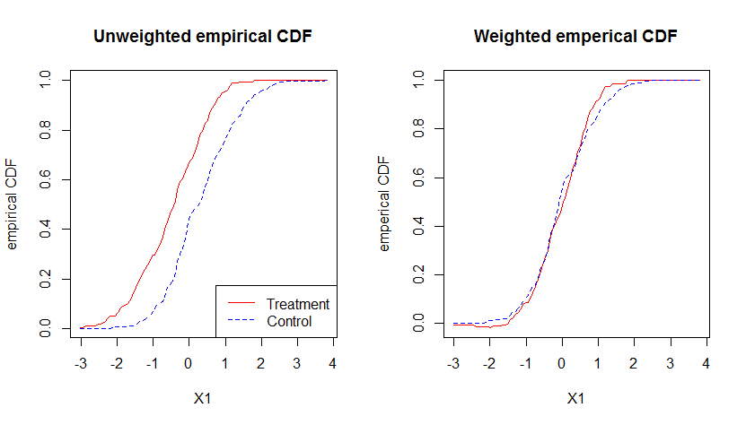
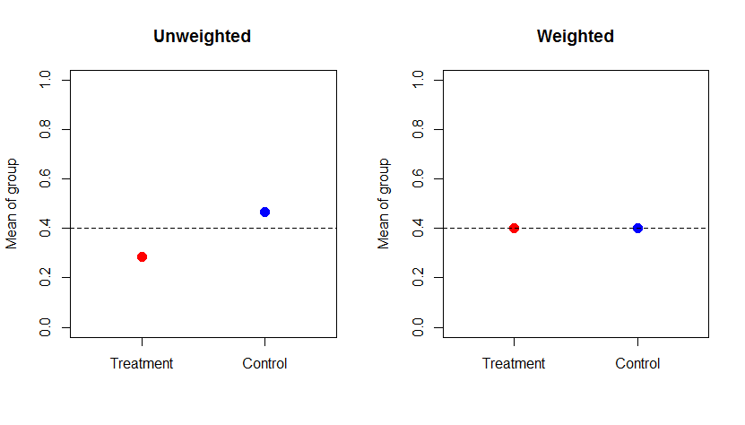
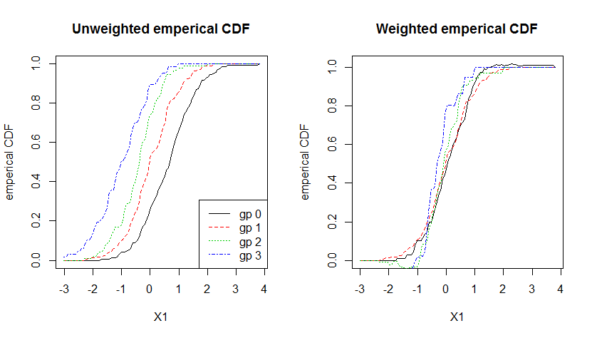
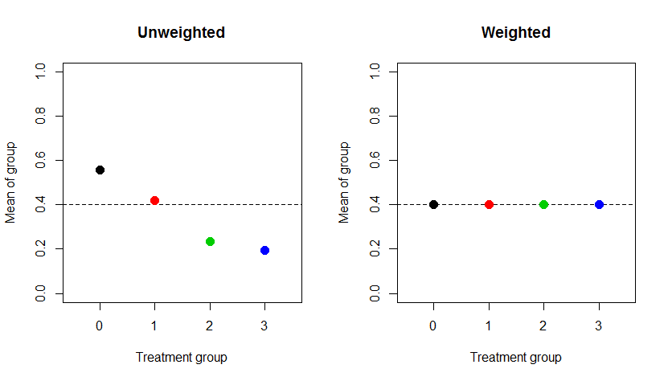

# R package: ATE

The main aim of `ATE` is to provide a user-friendly interface for nonparametric efficient inference of average 
treatment effects for observational data. The package provides point estimates for average treatment 
effects, average treatment effect on the treated and can also handle the case of multiple treatments.
The package also allows inference by consistent variance estimates.

-------------------------------------------------------------------------

##Key Features
* Ease of use: The main function `ATE` requires only a numeric matrix `X` of covariates, numeric vector `Y` of response 
and `treat` vector indicating treatment assignment.
```R
library(ATE)
#Generate some data
n<- 500
X1<- matrix(rnorm(n*5), ncol = 5)
X2<- matrix(rbinom(3*n, 1, 0.4), ncol = 3)
X<- cbind(X1, X2)
prop <- 1 / (1 + exp( X[,1] - 0.5*X[,2] + 0.25*X[,3] +  X[,6] + 0.5*X[,8] ) )
treat<- rbinom(n, 1, prop)
Y<-  10*treat+ (2*treat-1)*(X[,1] - 0.5*X[,2] + 0.25*X[,3] +  X[,6] + 0.5*X[,8]) + rnorm(n)

#Fit ATE object
fit1 <- ATE(Y,treat,X)
```
* `S3` summary methods for objects of class `ATE`.
```R
summary(fit1)

Call:
ATE(Y = Y, Ti = treat, X = X)

         Estimate    StdErr 95%.Lower 95%.Upper  Z.value p.value    
E[Y(0)] -0.625055  0.114586 -0.849640 -0.400470  -5.4549 4.9e-08 ***
E[Y(1)] 10.559242  0.084657 10.393317 10.725168 124.7291 < 2e-16 ***
E[Y(2)] 22.231546  0.241661 21.757899 22.705194  91.9946 < 2e-16 ***
E[Y(3)] 33.240013  0.352811 32.548516 33.931510  94.2148 < 2e-16 ***
---
Signif. codes:  0 ‘***’ 0.001 ‘**’ 0.01 ‘*’ 0.05 ‘.’ 0.1 ‘ ’ 1
```
* `plot` function for demonstrating effect of covariate balancing for continuous and binary 
covariates.
```R
plot(fit1)
```



* We can also estimate the average treatment effect on the treated. 
```R
fit2<-ATE(Y,treat,X, ATT = TRUE)
summary(fit2)
Call:
ATE(Y = Y, Ti = treat, X = X, ATT = TRUE)

             Estimate    StdErr 95%.Lower 95%.Upper Z.value p.value    
E[Y(1)|T=1]  9.820802  0.114407  9.596569 10.045035 85.8412  <2e-16 ***
E[Y(0)|T=1]  0.158785  0.127597 -0.091301  0.408870  1.2444  0.2133    
ATT          9.662018  0.214933  9.240757 10.083278 44.9537  <2e-16 ***
---
Signif. codes:  0 ‘***’ 0.001 ‘**’ 0.01 ‘*’ 0.05 ‘.’ 0.1 ‘ ’ 1
```
* `ATE` automatically detects and estimates the case of multiple treatment arm. 
```R
treat<- rbinom(n, 3, prop)
Y<-  10*treat+ (2*treat-1)*(X[,1] - 0.5*X[,2] + 0.25*X[,3] +  X[,6] + 0.5*X[,8]) + rnorm(n)
fit3<-ATE(Y,treat,X)
summary(fit3)

Call:
ATE(Y = Y, Ti = treat, X = X)

         Estimate    StdErr 95%.Lower 95%.Upper  Z.value p.value    
E[Y(0)] -0.625055  0.114586 -0.849640 -0.400470  -5.4549 4.9e-08 ***
E[Y(1)] 10.559242  0.084657 10.393317 10.725168 124.7291 < 2e-16 ***
E[Y(2)] 22.231546  0.241661 21.757899 22.705194  91.9946 < 2e-16 ***
E[Y(3)] 33.240013  0.352811 32.548516 33.931510  94.2148 < 2e-16 ***
---
Signif. codes:  0 ‘***’ 0.001 ‘**’ 0.01 ‘*’ 0.05 ‘.’ 0.1 ‘ ’ 1
plot(fit3)
```



* `ATE` uses the R packages `Rcpp` and `RcppArmadillo` to improve run-time. This allows us to handle big data efficiently.
Below we present the example for 10,000 observations and 800 covariates on an Intel® Core™ i5-3337U Processor.
```R
n<- 10000
X1<- matrix(rnorm(n*500), ncol = 500)
X2<- matrix(rbinom(300*n, 1, 0.4), ncol = 300)
X<- cbind(X1, X2)
prop <- 1 / (1 + exp( X[,1] - 0.5*X[,2] + 0.25*X[,3] +  X[,6] + 0.5*X[,8] ) )
treat<- rbinom(n, 1, prop)
Y<-  10*treat+ (2*treat-1)*(X[,1] - 0.5*X[,2] + 0.25*X[,3] +  X[,6] + 0.5*X[,8]) + rnorm(n)

system.time(fit4<-ATE(Y,treat,X))
   user  system elapsed 
  80.86    2.04   87.55
```
-------------------------------------------------------------------------
##Installation
* From CRAN: `install.packages("ATE")` currently version 0.2.0. Slow version without `RcppArmadillo`.
* From Github: `devtools::install_github("asadharis/ATE")` latest development version.

-------------------------------------------------------------------------
##Acknowledgements 
I would like to express my deep gratitude to Professor Gary Chan, my research supervisor, for his patient guidance, enthusiastic encouragement and useful critiques of this project.
